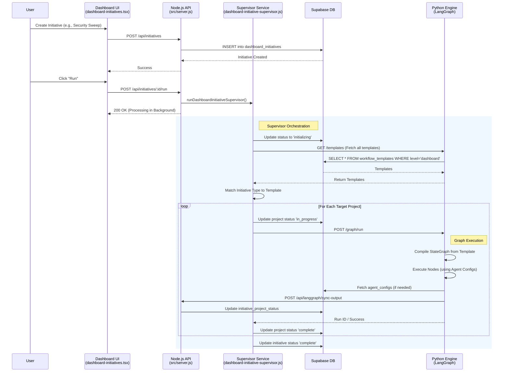
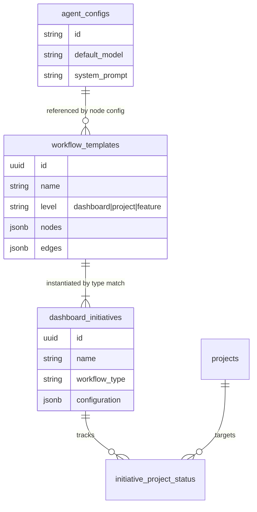

# Dashboard Workflow Architecture

## Agent & Workflow Management Flow (Dashboard Level)

This diagram illustrates how "Dashboard Initiatives" (cross-project workflows) are created, managed, and executed.

## Data Model Relationships

