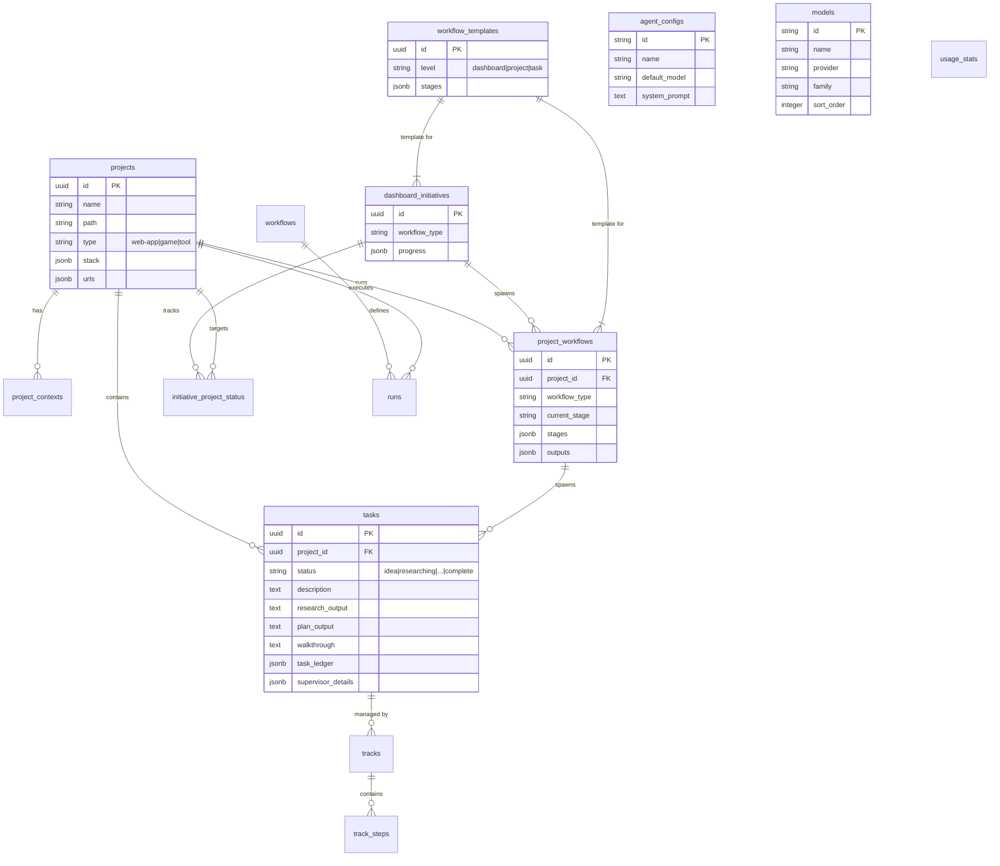

---
context_type: database-schema
status: current
updated_at: 2026-02-23T14:40:00.000Z
---

# Database Schema Reference

## Entity Relationship Diagram (ERD)

## Core Tables

### `projects`
The root entity for all data. Represents a tracked software project.
- **id** (UUID): Primary Key.
- **name** (Text): Unique project identifier/folder name.
- **path** (Text): Local filesystem path to the project.
- **type** (Text): Project type (`web-app`, `game`, `tool`).
- **stack** (JSONB): Technology stack details (inferred or user-defined).
- **urls** (JSONB): Links to production, repo, etc.

### `tasks`
Represents a specific unit of work within a project (formerly `features`).
- **id** (UUID): Primary Key.
- **project_id** (UUID): Foreign Key to `projects`.
- **name** (Text): Task title.
- **description** (Text): Rich markdown description including workflow type, goal, context, and acceptance criteria.
- **status** (Text): Current state (`idea`, `researching`, `researched`, `planning`, `planned`, `implementing`, `testing`, `complete`, `rejected`, `cancelled`).
- **research_output** (Text): Generated research report.
- **plan_output** (Text): Generated implementation plan.
- **walkthrough** (Text): Generated walkthrough/verification report.
- **task_ledger** (JSONB): Array of completed pipeline steps (agent, intent, status).
- **supervisor_status** (Text): Current supervisor routing state.
- **supervisor_details** (JSONB): Supervisor context and error tracking.

### `project_contexts`
Stores documentation and context files injected into AI prompts.
- **context_type** (Text): `product`, `tech-stack`, `product-guidelines`, `workflow`, `other`.
- **content** (Text): The Markdown content of the context file.

## Workflow Orchestration

### `dashboard_initiatives`
Cross-project workflows (e.g., "Security Sweep across all projects").
- **workflow_type** (Text): The type of initiative (maps to a template).
- **target_projects** (UUID[]): List of project IDs to execute against.
- **progress** (JSONB): Aggregate status of the initiative.

### `project_workflows`
Project-level processes (e.g., "Brand Development", "Release").
- **workflow_type** (Text): The type of workflow.
- **current_stage** (Text): ID of the active stage.
- **stages** (JSONB): Array of stage definitions (from template).
- **outputs** (JSONB): Map of stage results (e.g., spawned task IDs).

### `workflow_templates`
Definitions for standardized workflows. Stored as JSON files in `config/templates/`.
- **level** (Text): Scope of the workflow (`dashboard`, `project`, `task`).
- **stages** (JSONB): Ordered list of steps/stages.
- **nodes/edges** (JSONB): React Flow visual graph data for the workflow builder.

## Execution Engine (LangGraph)

### `workflows`
Visual workflow definitions created in the React Flow workflow builder.
- **graph_config** (JSONB): React Flow nodes and edges.
- **is_template** (Boolean): Whether this is a reusable template.

### `runs`
Active execution instances of a workflow graph.
- **status** (Text): `pending`, `running`, `paused`, `completed`, `failed`, `cancelled`.
- **current_node** (Text): The active node in the graph.
- **context** (JSONB): The global state object passed between nodes.

### `checkpoints`
LangGraph state snapshots for persistence and time-travel debugging.
- **thread_id** (Text): Corresponds to `run_id`.
- **checkpoint** (JSONB): The serialized graph state.

## Configuration & Tracking

### `agent_configs`
Definitions for system agents (supervisor, implementation, research, etc.).
- **id** (Text): Unique agent ID (e.g., `supervisor`, `implementation`).
- **default_model** (Text): The LLM model to use.
- **system_prompt** (Text): Base instructions for the agent.

### `models`
Registry of available AI models across all providers.
- **id** (Text): Model identifier (e.g., `gemini-3-flash-preview`).
- **provider** (Text): Provider name (`google`, `anthropic`, `openai`, `xai`).
- **family** (Text): Model family (`Gemini`, `Claude`, `GPT`, `Grok`).

### `usage_stats`
Aggregated token usage tracking per day per model.
- **date** (Date): Usage date.
- **model** (Text): Model identifier.
- **input_tokens / output_tokens / total_tokens** (BigInt): Token counts.
- **request_count** (Integer): Number of API calls.