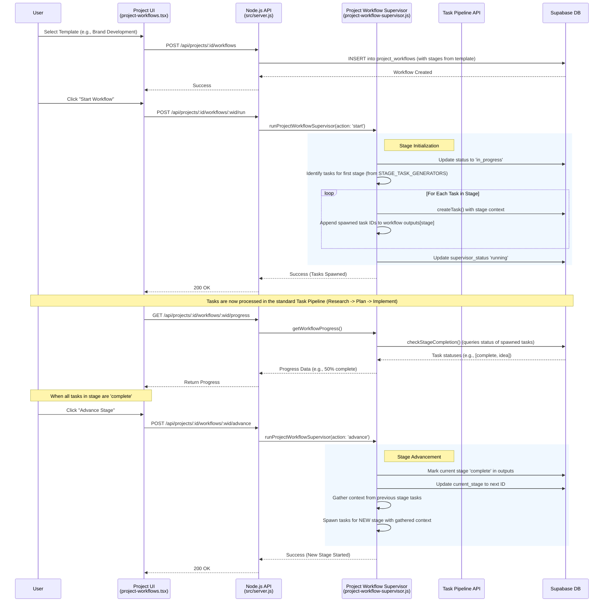
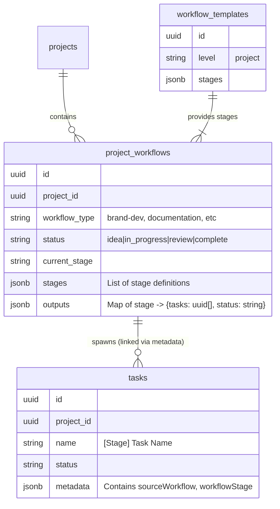

# Project Workflow Architecture

## Agent & Workflow Management Flow (Project Level)

This diagram illustrates how "Project Workflows" (multi-stage processes within a project) are managed and how they interact with the Feature Pipeline.

## Data Model Relationships

