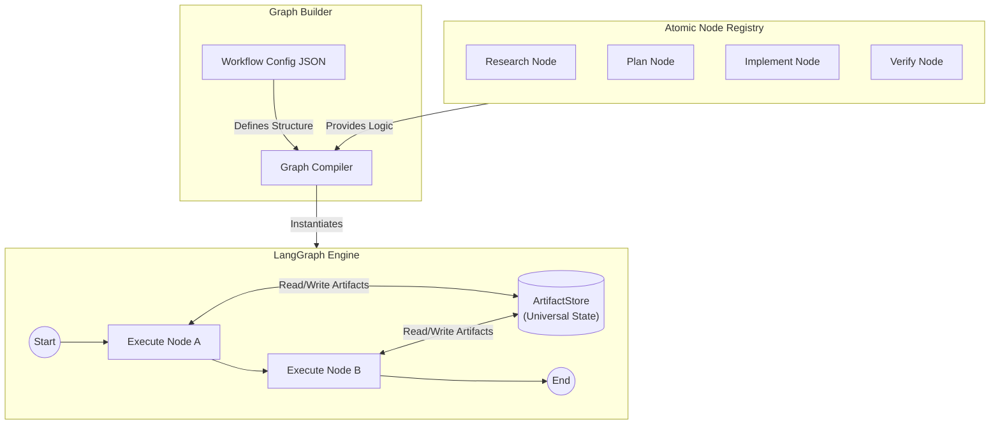
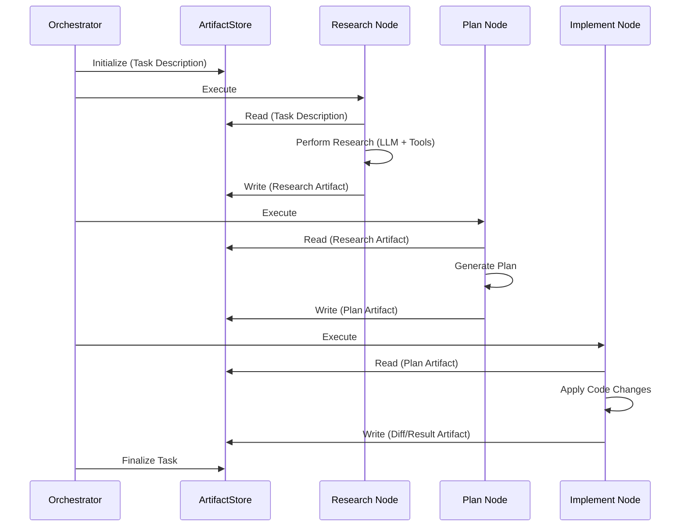

# Task Pipeline Architecture

## Overview

The Task Pipeline architecture has migrated from a hardcoded agent routing map to a dynamic **Atomic Node Registry**. This shift enables composable, n8n-style workflows where specific units of logic (Nodes) are assembled dynamically rather than following a rigid `Research -> Plan -> Implement` sequence.

## Atomic Node Registry

The core of the new system is the **Atomic Node Registry** (`nexus-builder/nodes/registry.py`). Instead of monolithic "Agents", the system defines atomic "Nodes".

- **Definition**: A Node is a discrete unit of execution (e.g., `ResearchNode`, `PlanNode`, `CodeEditNode`).
- **Registration**: Nodes are registered in a central repository, making them available to the Graph Builder.
- **Configurability**: Each node exposes a schema for configuration, allowing the frontend or API to parameterize execution (e.g., setting the model, temperature, or specific prompt templates).

## Universal Artifact System (ArtifactStore)

To facilitate robust data exchange between atomic nodes, the system employs a **Universal Artifact System**.

- **ArtifactStore**: A central state object that holds structured data produced by nodes.
- **Data Flow**: Unlike simple string passing, nodes consume specific Artifacts (e.g., `ResearchReport`, `FileContext`) and produce new ones (e.g., `ImplementationPlan`, `CodeDiff`).
- **Persistence**: Artifacts are serialized and stored, allowing workflows to pause, resume, or be inspected at any stage.

## Architecture Diagrams

### Node Registration & Execution

This diagram illustrates how atomic nodes are registered, compiled into a LangGraph, and executed using the ArtifactStore.

### Standard Task Workflow (Node Composition)

While the system is dynamic, the standard "Task" workflow is now a specific composition of atomic nodes.

## Key Components

| Component | Description |
| :--- | :--- |
| **Node Registry** | Python module (`nexus-builder/nodes/registry.py`) containing all available workflow nodes. |
| **ArtifactStore** | The shared state dictionary passed through the LangGraph, replacing unstructured chat history. |
| **Graph Compiler** | Converts a JSON workflow definition into a runnable LangGraph `StateGraph`. |
| **Atomic Node** | A Python class/function implementing a specific step (e.g., `GitCommitNode`, `LLMGenerateNode`). |

## Migration Status

- [x] **Legacy**: Hardcoded `Supervisor -> Agent` routing.
- [x] **Current**: Atomic Nodes defined in Registry.
- [x] **State**: `ArtifactStore` implemented for structured data passing.
- [ ] **Future**: Full UI for drag-and-drop node composition (n8n style).