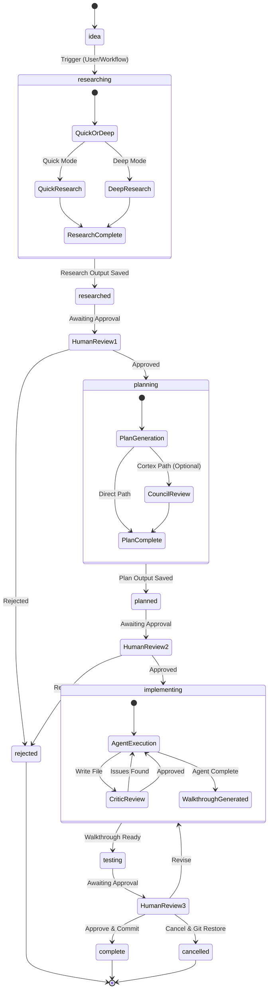
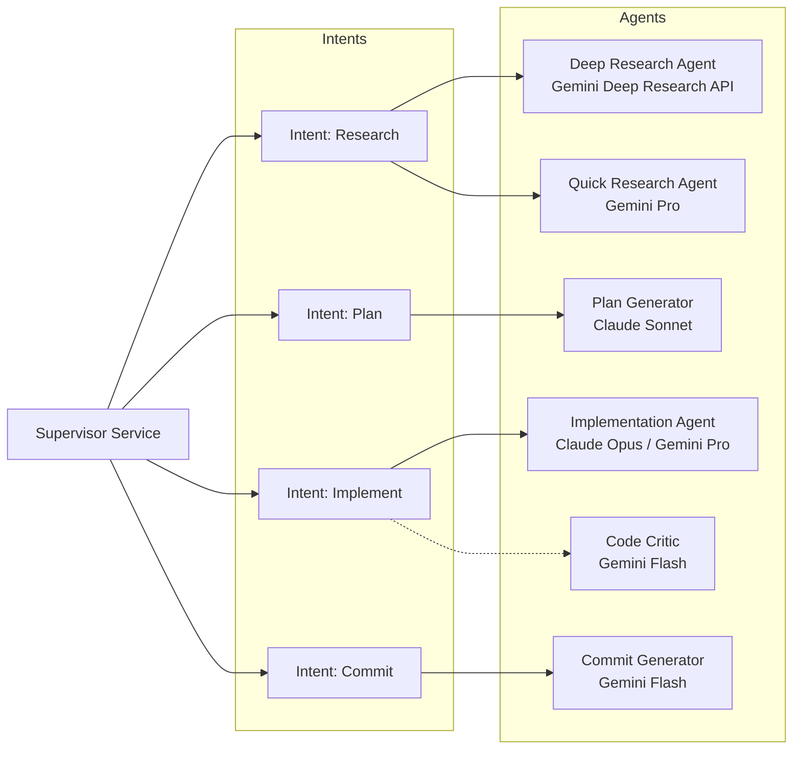

# Task Pipeline Architecture

## Task-Level Workflow Management

This diagram illustrates how individual tasks are processed through the Task Pipeline, driven by the Nexus Prime workflow.

### Nexus Prime Pipeline Flow

### Agent Routing Map

### Data Model & State Tracking

Tasks maintain their state via the `tasks` table columns.

```mermaid
erDiagram
    tasks {
        uuid id
        string status "idea|researching|planning|...|complete"
        string supervisor_status "idle|routing|delegating"
        text description "Ticket: Workflow, Goal, Context, Criteria"
        text research_output
        text plan_output
        text walkthrough
        jsonb task_ledger "Array of completed steps"
        jsonb supervisor_details "Current supervisor state"
    }

    %% JSONB Structure for task_ledger entries
    task_ledger_entry {
        string taskId
        string status "completed|failed"
        string agent
        string intent
        timestamp completedAt
    }
```

---
context_type: task-pipeline-map
status: active
updated_at: 2026-03-01T19:08:11.561Z
---
