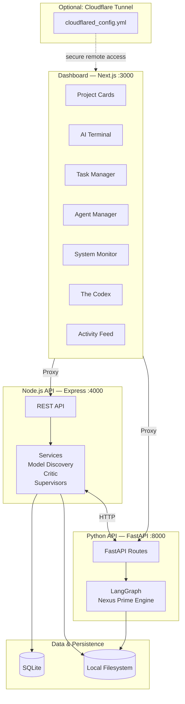
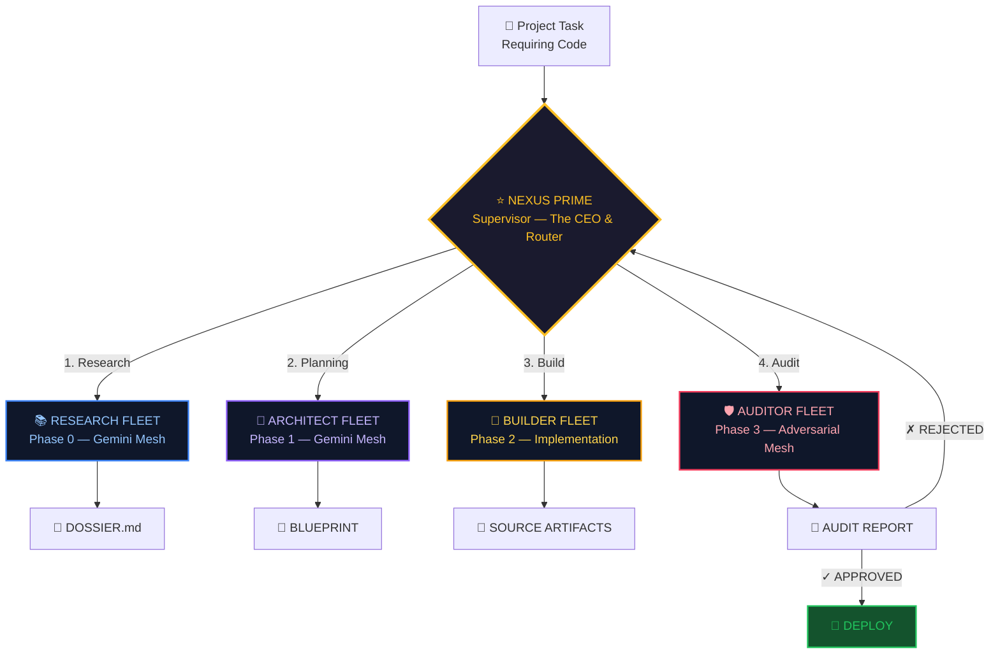
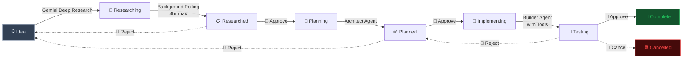
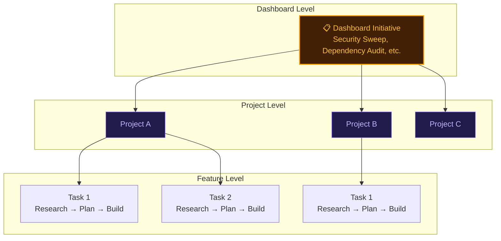

# The Nexus 🌐

**Personal Agentic Workspace** — A hybrid local platform for managing projects, orchestrating AI agents, and automating development workflows through a multi-agent architecture.

[](https://nodejs.org)
[](https://nextjs.org)
[](https://langchain-ai.github.io/langgraph/)

---

## 📋 Table of Contents

- [Overview](#overview)
- [Architecture](#architecture)
- [Quick Start](#quick-start)
- [Configuration](#configuration)
- [Project Discovery](#project-discovery)
- [API Reference](#api-reference)
- [AI Integration](#ai-integration)
- [SOTA Model Discovery](#sota-model-discovery)
- [Nexus Prime — LangGraph Workflow Engine](#nexus-prime--langgraph-workflow-engine)
- [Agent Manager](#agent-manager)
- [System Monitor](#system-monitor)
- [MCP Server](#mcp-server)
- [Task Manager](#task-manager)
- [Multi-Level Workflow System](#multi-level-workflow-system)
- [Agent System](#agent-system)
- [The Codex](#the-codex)
- [Dashboard Components](#dashboard-components)
- [Cloudflare Tunnel (Optional)](#cloudflare-tunnel-optional)
- [Development](#development)
- [Known Complexities](#known-complexities)

---

## Overview

The Nexus transforms a local development machine into a personal agentic workspace, bridging your filesystem with a web-accessible dashboard and a multi-agent AI engine. It provides:

- **Project Discovery** — Auto-detect and display projects from `~/Projects` directory
- **Git Management** — Initialize repos, add remotes, commit and push with AI-generated messages
- **AI Terminal** — Multi-provider chat interface (Google Gemini, Anthropic Claude, OpenAI, xAI Grok)
- **Task Manager** — Full AI-powered workflow: Research → Plan → Implement → Complete
- **Agent Manager** — Configure and customize AI agents via dashboard UI
- **Nexus Prime** — LangGraph-based multi-agent workflow engine with Architect → Builder → Auditor pipeline and adversarial review
- **SOTA Model Discovery** — Automatic detection of the latest AI models from all providers at startup
- **The Codex** — Centralized documentation hub with interactive system architecture visualizations
- **System Monitor** — Real-time CPU, memory, and port monitoring dashboard
- **Code Critic** — AI-powered code review before file writes
- **MCP Server** — Model Context Protocol integration for seamless AI agent interoperability
- **Secure Sandbox** — Containerized code execution environment with session persistence

---

## Architecture



### Directory Structure

```
TheNexus/                           # Flat monorepo
├── server/                         # Node.js Express backend
│   ├── server.js                   # Main API server
│   ├── scanner.js                  # Project discovery engine
│   ├── mcp.js                      # MCP Server (stdio)
│   ├── auto-research.js            # Gemini Deep Research integration
│   ├── agent/                      # Multi-provider AI agent
│   ├── routes/                     # Modular route handlers
│   │   ├── initiatives.js          # Dashboard initiative routes
│   │   ├── langgraph.js            # LangGraph proxy routes
│   │   ├── mcp-inline.js           # Inline MCP routes
│   │   ├── mcp-scopes.js           # MCP scope management
│   │   ├── memory.js               # Memory management routes
│   │   ├── tools.js                # Tool routes
│   │   └── workflows.js            # Workflow routes
│   ├── services/                   # Business logic services
│   │   ├── ai-service.js           # AI provider abstraction
│   │   ├── audit-logger.js         # Audit trail logging
│   │   ├── auto-documentation.js   # Auto-doc generation
│   │   ├── conductor.js            # Workflow conductor
│   │   ├── context-sync.js         # Project context sync
│   │   ├── critic.js               # Code review service
│   │   ├── model-discovery.js      # SOTA model auto-detection
│   │   ├── system-monitor.js       # System resource monitor
│   │   ├── langgraph-supervisor.js # LangGraph task supervisor
│   │   ├── dashboard-initiative-supervisor.js
│   │   ├── project-workflow-supervisor.js
│   │   └── supervisor-sync.js      # Supervisor state sync
│   ├── middleware/                  # Express middleware
│   ├── memory/                     # Memory management
│   ├── tools/                      # Agent tool definitions
│   └── utils/                      # Retry & utility helpers
├── dashboard/                      # Next.js 16 frontend
│   └── src/
│       ├── app/                    # App Router pages
│       │   ├── codex/              # The Codex documentation hub
│       │   ├── project/            # Project detail pages
│       │   ├── workflow-builder/   # Visual workflow builder
│       │   ├── system-monitor/     # System monitor page
│       │   └── login/              # Login page
│       ├── components/             # UI components
│       └── lib/                    # API client & utilities
│           └── nexus.ts            # Centralized API client
├── nexus-builder/                  # Python graph engine & workflow (Nexus Prime)
│   ├── main.py                     # FastAPI entry point
│   ├── graph_engine.py             # LangGraph workflow engine
│   ├── node_registry.py            # Code-defined node registry
│   ├── nexus_workflow.py           # Nexus Prime workflow definition
│   ├── nexus_config.py             # Nexus configuration
│   ├── model_config.py             # Model configuration
│   ├── context_injector.py         # Context injection for agents
│   ├── context_manager.py          # Project context management
│   ├── token_tracker.py            # Token usage tracking
│   ├── tools.py                    # Shared tool definitions
│   ├── architect/                  # Architect agent (planning)
│   ├── builder/                    # Builder agent (implementation)
│   ├── auditor/                    # Auditor agent (adversarial review)
│   ├── supervisor/                 # Supervisor agent (orchestration)
│   ├── researcher/                 # Research agent
│   ├── workflow/                   # Workflow definitions & static data
│   ├── nodes/                      # Custom graph nodes
│   ├── tools/                      # Agent-specific tools
│   ├── templates/                  # Project templates
│   ├── context/                    # Context documents
│   └── migrations/                 # Database migrations
├── cortex/                         # Python AI Brain (legacy, being integrated into nexus-builder)
│   ├── agents/                     # Planner, Council, Browser, Compiler
│   ├── api/                        # Terminal bridge, routes
│   ├── core/                       # Orchestrator graph
│   ├── schemas/                    # Pydantic state models
│   ├── blackboard/                 # Research blackboard
│   ├── interface/                  # Agent interface definitions
│   ├── config.py                   # Cortex configuration
│   ├── llm_factory.py              # Multi-provider LLM routing
│   ├── llm_utils.py                # LLM helper utilities
│   ├── node_registry.py            # Cortex-level node registry
│   └── usage_callback.py           # Token usage callback handler
├── sandbox/                        # Secure code execution sandbox
│   ├── server.py                   # Sandbox API server
│   ├── executor.py                 # Code execution engine
│   ├── sessions.py                 # Session management with persistence
│   ├── database.py                 # Sandbox database
│   └── models.py                   # Data models
├── config/                         # Centralized configuration
│   ├── model_registry.yaml         # LLM model configs
│   ├── prompts.yaml                # System prompts
│   ├── ingestion.yaml              # Data ingestion config
│   ├── nexus/                      # Nexus-specific config
│   └── templates/                  # Config templates
├── db/                             # Database schema & migrations (SQLite)
│   ├── schema-sqlite.sql           # SQLite schema definition
│   ├── index.js                    # Database access layer
│   └── migrations/                 # SQL migration files
├── docker/                         # Sandbox Dockerfiles
├── docs/                           # Documentation
├── tests/                          # Test suites
├── package.json                    # Node.js dependencies (root)
├── start-nexus.bat                 # Windows full startup (with tunnel)
├── start-local.bat                 # Local dev startup (recommended)
├── stop-nexus.bat                  # Stop all services
└── .env                            # Environment variables
```

---

## Quick Start

### Prerequisites

- **Node.js** 18+
- **Python** 3.10+ (for nexus-builder & cortex)
- **npm**
- API keys for AI providers (at least one required for AI features)

### Installation

```bash
# Clone the repository
git clone https://github.com/VIbeShiftAI/TheNexus.git
cd TheNexus

# Install backend dependencies
npm install

# Install dashboard dependencies
cd dashboard
npm install
cd ..

# Set up Python environment for nexus-builder
cd nexus-builder
python -m venv venv
venv\Scripts\activate     # Windows
pip install -r requirements.txt
cd ..

# Create environment file
cp .env.example .env  # Then edit with your API keys
```

### Running

**Option 1: Local development startup (recommended)**

```batch
start-local.bat
```

This opens three terminal windows:
1. LangGraph Engine — Python backend (port 8000)
2. Node.js Backend — Express API (port 4000)
3. Next.js Dashboard — Frontend (port 3000)

**Option 2: Full startup with Cloudflare Tunnel**

```batch
start-nexus.bat
```

This opens four terminal windows (adds Cloudflare Tunnel for remote access).

**Option 3: Manual startup**

```bash
# Terminal 1 - Python LangGraph Engine
cd nexus-builder && venv\Scripts\activate && uvicorn main:app --reload --port 8000

# Terminal 2 - Node.js Backend
node server/server.js

# Terminal 3 - Dashboard
cd dashboard && npm run dev
```

### Access Points

| Endpoint | URL |
|----------|-----|
| Dashboard | http://localhost:3000 |
| Node.js API | http://localhost:4000/api/projects |
| LangGraph API | http://localhost:8000 |

---

## Configuration

### Environment Variables

Create a `.env` file in the project root:

```env
# Required: Set your projects directory
PROJECT_ROOT=C:/Projects

# AI Providers (at least one required for AI features)
GOOGLE_API_KEY=your-gemini-api-key
ANTHROPIC_API_KEY=your-claude-api-key
OPENAI_API_KEY=your-openai-api-key
XAI_API_KEY=your-xai-api-key

# Frontend URLs
NEXT_PUBLIC_API_URL=http://localhost:4000
NEXT_PUBLIC_CORTEX_URL=http://localhost:8000
```

> **Note:** `GOOGLE_API_KEY` and `GEMINI_API_KEY` are interchangeable. The system checks both.

### AI Model Configuration

Models are configured via `config/model_registry.yaml` and automatically enhanced by the [SOTA Model Discovery](#sota-model-discovery) service at startup. See the dedicated section below for details.

---

## Project Discovery

### How Projects Are Detected

The scanner (`server/scanner.js`) scans `PROJECT_ROOT` and detects projects using a priority-based system:

1. **Configured Projects** — Has a `project.json` file (full metadata)
2. **Unconfigured Projects** — Has `package.json`, `requirements.txt`, or `.git`
3. **Empty Folders** — Ignored

### project.json Schema

Create a `project.json` in any project to configure its appearance:

```json
{
    "name": "MyProject",
    "type": "web-app",           // "game" | "tool" | "web-app"
    "description": "A cool project",
    "created": "2025-12-16T06:43:35-05:00",
    "vibe": "immaculate",
    "tasks": [
        "Task 1",
        "Task 2"
    ],
    "stack": {
        "backend": "Node.js",
        "frontend": "React"
    },
    "urls": {
        "production": "https://myproject.com",
        "repo": "https://github.com/user/myproject"
    },
    "tasksList": []        // Managed by the Task Manager
}
```

---

## Project Context Manager

Each project can store context documents that are injected into AI prompts for better understanding:

| Context Type | Description |
|-------------|-------------|
| `product` | Product Vision - High-level product strategy and goals |
| `tech-stack` | Tech Stack - Defined technologies and architectural choices |
| `product-guidelines` | Guidelines - Design principles and product guidelines |
| `workflow` | Workflow - Team processes and ways of working |

**UI Component:** `project-context-manager.tsx` on the project page provides a tabbed interface for editing each context type.

**API Endpoints:**

| Method | Endpoint | Description |
|--------|----------|-------------|
| `GET` | `/api/projects/:id/context` | Get all contexts for a project |
| `PUT` | `/api/projects/:id/context/:type` | Update a specific context type |

**Usage:** Context is automatically injected when agents run tasks scoped to a project, providing consistent product knowledge across all AI interactions.

---

## API Reference

### Core Endpoints

| Method | Endpoint | Description |
|--------|----------|-------------|
| `GET` | `/api/projects` | List all discovered projects |
| `GET` | `/api/projects/:id` | Get single project details |
| `GET` | `/api/projects/:id/status` | Get git status |
| `GET` | `/api/projects/:id/commits` | Get commit history (max 50) |
| `GET` | `/api/projects/:id/ping` | Ping production URL |
| `POST` | `/api/projects/scaffold` | Create new project |

### Git Operations

| Method | Endpoint | Description |
|--------|----------|-------------|
| `POST` | `/api/projects/:id/git/init` | Initialize git |
| `POST` | `/api/projects/:id/git/remote` | Add remote origin |
| `POST` | `/api/projects/:id/commit-push` | Commit and push changes |
| `GET` | `/api/projects/:id/diff` | Get current diff |
| `POST` | `/api/projects/:id/generate-commit-message` | AI-generate commit message |

### System Monitor

| Method | Endpoint | Description |
|--------|----------|-------------|
| `GET` | `/api/system/status` | Get CPU, memory, and port info |
| `GET` | `/api/system/usage-stats` | Get AI token usage statistics |

### Agent Configuration

| Method | Endpoint | Description |
|--------|----------|-------------|
| `GET` | `/api/agents/config` | Get all agent configurations |
| `PUT` | `/api/agents/:id` | Update agent configuration |
| `PUT` | `/api/agents/critic/toggle` | Enable/disable code critic |

### Pin Management

| Method | Endpoint | Description |
|--------|----------|-------------|
| `GET` | `/api/pins` | Get pinned project IDs |
| `POST` | `/api/projects/:id/pin` | Pin a project |
| `DELETE` | `/api/projects/:id/pin` | Unpin a project |

### AI Chat

| Method | Endpoint | Description |
|--------|----------|-------------|
| `POST` | `/api/ai/chat` | Send message to AI |

**Request Body:**

```json
{
    "message": "Your message",
    "modelConfig": {
        "id": "gemini-2.5-flash",
        "apiModelId": "gemini-2.5-flash",
        "provider": "Google",
        "isThinking": false,
        "parameters": {}
    },
    "mode": "agent",            // "agent" | "code" | default
    "history": [],              // Previous messages
    "projectId": "MyProject"    // Optional: scope to project
}
```

### Activity Feed

| Method | Endpoint | Description |
|--------|----------|-------------|
| `GET` | `/api/activity` | Get recent commits across all projects |

---

## AI Integration

### Multi-Provider Support

The system supports four AI providers with automatic format conversion:

#### Google Gemini
- Models: Auto-discovered (latest Pro and Flash)
- Supports: Thinking config (`thinking_level`, `thinking_budget`)
- Used for: Research (with thinking), quick tasks

#### Anthropic Claude
- Models: Auto-discovered (latest Opus, Sonnet, Haiku)
- Supports: Extended thinking (`budget_tokens`)
- Used for: Planning, implementation

#### OpenAI
- Models: Auto-discovered (latest GPT)
- Supports: `reasoning_effort`

#### xAI Grok
- Models: Auto-discovered (latest Grok)
- Supports: Standard chat completion format
- Used for: General-purpose tasks

### AI Terminal Component

The dashboard includes a full-featured AI terminal (`dashboard/src/components/ai-terminal.tsx`) with:

- Model selector with provider-specific configurations
- Thinking mode toggle
- Conversation history
- Project scoping
- Streaming responses

---

## SOTA Model Discovery

The Model Discovery Service (`server/services/model-discovery.js`) ensures The Nexus always uses the latest AI models without manual configuration.

### How It Works

On server startup, the service queries the model listing APIs of all four providers in parallel:

1. **Google** — `generativelanguage.googleapis.com/v1beta/models`
2. **OpenAI** — `api.openai.com/v1/models`
3. **Anthropic** — `api.anthropic.com/v1/models`
4. **xAI** — `api.x.ai/v1/models`

For each provider, it matches raw model IDs against known **model families** (e.g., Gemini Pro, Claude Opus, GPT) using regex patterns, then selects the **highest version** per family:

```
[Model Discovery] Complete in 1200ms. Summary:
  → Gemini 3 Pro (Google) [gemini-3-pro] ⚡ Thinking
  → Gemini 3 Flash (Google) [gemini-3-flash]
  → GPT-5.2 (OpenAI) [gpt-5.2]
  → Claude Opus 4.6 (Anthropic) [claude-opus-4-6]
  → Claude Sonnet 4 (Anthropic) [claude-sonnet-4]
  → Claude Haiku 4 (Anthropic) [claude-haiku-4]
  → Grok 3 (xAI) [grok-3]
```

### Key Features

- **Zero-config model upgrades** — When a provider releases a new model, The Nexus picks it up automatically at next startup
- **Graceful degradation** — If a provider's API key is missing or the API call fails, that provider is skipped without affecting others
- **Thinking model detection** — Automatically flags models with reasoning/thinking capabilities
- **Unified schema** — All discovered models are normalized into a consistent format with `id`, `apiModelId`, `name`, `provider`, and `isThinking` fields

---

## Nexus Prime — LangGraph Workflow Engine

The Nexus Prime pipeline (`nexus-builder/`) is the core multi-agent workflow engine built on LangGraph. It implements a 4-phase fleet architecture where specialized agent teams handle Research, Architecture, Building, and Auditing with adversarial review loops.

### High-Level Flow



### Phase 0: Research Fleet (Gemini Mesh)

| Agent | Model | Task |
|-------|-------|------|
| **Scoper** | Gemini Pro | Define search queries from task |
| **The Professor** | Gemini Flash | Relevance check on queries (reject → re-scope) |
| **Executor** | Gemini Pro | Web search & scrape execution |
| **Synthesizer** | Gemini Pro | Compile research into DOSSIER.md |

**Output:** `DOSSIER.md` — API documentation, design patterns, library versions

### Phase 1: Architect Fleet (Gemini Mesh)

| Agent | Model | Task |
|-------|-------|------|
| **Cartographer** | Gemini Pro | Read dossier + repository structure |
| **Drafter** | Gemini Pro | Write implementation spec |
| **Grounder** | Gemini Flash | Validate file paths (reject hallucinations → re-draft) |

**Output:** `BLUEPRINT` — SPEC.md (logic), MANIFEST.json (files), DDB.json (audit rules)

### Phase 2: Builder Fleet (Implementation)

| Agent / System | Model | Task |
|----------------|-------|------|
| ⚙ **System: Loader** | — | Pre-load files from manifest |
| **Scout** | Gemini Pro | Navigate symbols & locate insertion points |
| **Builder** | Gemini Pro | Write code ("Vibe Coding") |
| ⚙ **System: Syntax** | — | AST check / linter (syntax errors → re-build) |

**Output:** `SOURCE ARTIFACTS` — Updated files, DIFF.patch

### Phase 3: Auditor Fleet (Adversarial Mesh)

| Agent / System | Model | Task |
|----------------|-------|------|
| ⚙ **System: Blast Calc** | — | Generate dependency graph |
| **The Sentinel** | Claude Opus | Security analysis |
| **The Interrogator** | Claude Opus | Dry-run tests on suspicious changes |

**Output:** `AUDIT REPORT` — Pass/Fail status, blocking issues list, security score

### Key Files

| File | Purpose |
|------|---------|
| `graph_engine.py` | Core LangGraph workflow engine |
| `nexus_workflow.py` | Nexus Prime workflow definition |
| `supervisor/agent.py` | Supervisor orchestration logic |
| `architect/agent.py` | Planning agent |
| `builder/agent.py` | Implementation agent |
| `auditor/agent.py` | Adversarial review agent |
| `node_registry.py` | Code-defined atomic node registry |

---

## Agent Manager

The Agent Manager (`dashboard/src/components/agent-manager.tsx`) provides a dashboard UI for configuring AI agents without editing code.

### Features

- **View all configured agents** with their descriptions and default models
- **Edit system prompts** to customize agent behavior
- **Change default models** for each agent type
- **Toggle Code Critic** on/off globally
- **Live save** with visual feedback

### Reasoning Levels

The system supports three reasoning levels:

| Level | Description | Reflection | Thinking Level | Max Turns |
|-------|-------------|------------|----------------|-----------|
| **Vibe** | Fast execution for simple tasks | Disabled | LOW | 20 |
| **Standard** | Single-step reflection for typical tasks | Enabled | MEDIUM | 50 |
| **Deep** | Multi-path exploration for complex work | Enabled | HIGH | 100 |

---

## System Monitor

The System Monitor (`server/services/system-monitor.js`) provides real-time system resource information.

### Features

- **CPU Usage** — Current load percentage and core count
- **Memory Usage** — Total, used, free, and percentage
- **Port Monitoring** — Active listening ports with process identification
- **Dev Server Detection** — Automatic labeling of known ports (3000=Next.js, 4000=Express, etc.)

### Dashboard Integration

The Resource Monitor component (`dashboard/src/components/resource-monitor.tsx`) displays:
- Gauge-style CPU and memory meters
- Token usage tracking with historical graphs
- Active port list with hints
- Auto-refresh every 5 seconds

### Known Port Mappings

| Port | Framework |
|------|-----------| 
| 3000 | Next.js/React |
| 3001 | Next.js (alt) |
| 4000 | Express/API |
| 5000 | Flask/Vite |
| 5173 | Vite |
| 8000 | Django/FastAPI |
| 8080 | Generic HTTP |
| 27017 | MongoDB |
| 5432 | PostgreSQL |
| 3306 | MySQL |
| 6379 | Redis |

---

## MCP Server

The Nexus implements an **MCP (Model Context Protocol) Server** for AI agent integration.

### Starting the MCP Server

```bash
node server/mcp.js
```

The server runs on stdio and can be connected via any MCP-compatible client.

### Available Resources

| URI | Description |
|-----|-------------|
| `projects://list` | JSON list of all projects |

### Available Tools

| Tool | Description | Parameters |
|------|-------------|------------|
| `scaffold_new_vibe` | Create a new project | `name`, `type` |
| `init_git` | Initialize git in project | `project_name` |
| `add_remote` | Add git remote | `project_name`, `remote_url` |
| `commit_and_push` | Commit and push changes | `project_name`, `message` |

### MCP Integration Example

Connect to the Nexus MCP server from Antigravity or other MCP clients:

```json
{
    "name": "local-nexus",
    "command": "node",
    "args": ["path/to/TheNexus/server/mcp.js"]
}
```

> **Known Issue:** The dotenv 17.x library outputs to stdout, which breaks MCP protocol. This is suppressed via `DOTENV_CONFIG_QUIET=true` at the top of `mcp.js`.

---

## Task Manager

The Nexus includes a complete AI-powered task development workflow:



### Task Status States

| Status | Description |
|--------|-------------|
| `idea` | Initial state, no AI work done |
| `researching` | Deep Research Agent running (background) |
| `researched` | Research complete, awaiting approval |
| `planning` | Architect generating implementation plan |
| `planned` | Plan complete, awaiting approval |
| `implementing` | Builder agent executing the plan |
| `testing` | Implementation done, walkthrough ready |
| `complete` | Approved, committed, and pushed |
| `rejected` | Rejected by user, archived |
| `cancelled` | Cancelled and reverted |

### Task Manager Endpoints

| Method | Endpoint | Description |
|--------|----------|-------------|
| `GET` | `/api/projects/:id/tasks` | Get all tasks |
| `POST` | `/api/projects/:id/tasks` | Add new task |
| `PATCH` | `/api/projects/:id/tasks/:taskId` | Update task |
| `DELETE` | `/api/projects/:id/tasks/:taskId` | Delete task |
| `POST` | `.../research` | Trigger Deep Research |
| `POST` | `.../approve-research` | Approve research → generate plan |
| `POST` | `.../reject-research` | Reject research → revert to idea |
| `POST` | `.../approve-plan` | Approve plan |
| `POST` | `.../reject-plan` | Reject plan → revert to idea |
| `POST` | `.../implement` | Trigger AI implementation |
| `POST` | `.../approve-walkthrough` | Approve → commit & push |
| `POST` | `.../reject-walkthrough` | Reject → revert to planned |
| `POST` | `.../cancel-walkthrough` | Cancel, git revert, archive |

### Deep Research Agent

The research phase uses the **Gemini Deep Research Agent** with background polling:

```javascript
// Research runs asynchronously with polling up to 4 hours
async function runDeepResearch(prompt, apiKey, callbacks, existingInteractionId = null) {
    // Creates background interaction
    // Polls every 10 seconds
    // Persists interactionId to project.json for resume capability
}
```

**Resume on Restart:** If the server restarts while research is in progress, `resumeDeepResearch()` automatically resumes polling for any tasks with `status: 'researching'` and a saved `researchInteractionId`.

---

## Multi-Level Workflow System

The Nexus supports workflows at three hierarchical levels:



### Dashboard Initiatives

Cross-project workflows that span multiple projects:

| Type | Description |
|------|-------------|
| `security-sweep` | Run security audits across all targeted projects |
| `dependency-audit` | Check for outdated and vulnerable dependencies |
| `readme-update` | Update README files across projects |
| `api-migration` | Migrate projects to new API versions |
| `health-check` | Monthly maintenance check across projects |

**Dashboard UI (`dashboard-initiatives.tsx`):**
- Collapsible initiatives section on the main Dashboard page
- Initiative cards with type icons, status badges, and progress bars
- Create modal with name, description, type selection, and project targeting
- Run and delete actions for each initiative

### Project Workflows

Project-level workflows with predefined templates:

| Template | Stages |
|----------|--------|
| **Brand Development** | Discovery → Concepts → Logo Design → Color Palette → Typography → Guidelines |
| **Logo Development** | Creative Brief → Concepts → Refinement → Finalization → Export |
| **Documentation** | README → API Docs → User Guide → Contributing |
| **Release** | Changelog → Version Bump → Build → Deploy → Announce |

**Context Passing:** Outputs from previous workflow stages (research reports, plans, walkthroughs) are automatically passed as context to subsequent stages, enabling coherent multi-stage workflows.

### Multi-Level Workflow Endpoints

**Dashboard Initiatives:**

| Method | Endpoint | Description |
|--------|----------|-------------|
| `GET` | `/api/initiatives` | List all initiatives |
| `POST` | `/api/initiatives` | Create new initiative |
| `GET` | `/api/initiatives/:id` | Get initiative with progress |
| `PATCH` | `/api/initiatives/:id` | Update initiative |
| `DELETE` | `/api/initiatives/:id` | Delete initiative |
| `POST` | `/api/initiatives/:id/run` | Execute initiative |

**Project Workflows:**

| Method | Endpoint | Description |
|--------|----------|-------------|
| `GET` | `/api/projects/:id/workflows` | List project workflows |
| `POST` | `/api/projects/:id/workflows` | Create workflow from template |
| `PATCH` | `/api/projects/:id/workflows/:wid` | Update workflow |
| `DELETE` | `/api/projects/:id/workflows/:wid` | Delete workflow |
| `POST` | `/api/projects/:id/workflows/:wid/run` | Run workflow |

**Workflow Templates:**

| Method | Endpoint | Description |
|--------|----------|-------------|
| `GET` | `/api/workflow-templates` | List all templates |
| `GET` | `/api/workflow-templates?level=project` | Filter by level |
| `POST` | `/api/workflow-templates` | Create custom template |

---

## Agent System

### Tool-Using Agent

The agent (`server/agent/index.js`) implements a multi-turn tool-using loop:

```javascript
async function runAgent({ 
    message, 
    history = [], 
    projectRoot, 
    model = 'gemini-2.5-flash', 
    scopedProject = null  // Security: restrict access to single project
}) {
    // 1. Build context with visible projects
    // 2. Initialize messages based on provider
    // 3. Loop up to MAX_TURNS (10)
    //    - Call AI (Gemini or Claude)
    //    - If tool calls, execute tools
    //    - Feed results back to AI
    // 4. Return final response
}
```

### Available Tools

| Tool | Description |
|------|-------------|
| `read_file` | Read file contents with offset/range support |
| `write_file` | Create or overwrite file (with Critic review) |
| `patch_file` | Replace specific text in file (multi-replacement) |
| `append_file` | Append content to end of file |
| `apply_diff` | Apply unified diff for efficient targeted edits |
| `edit_lines` | Edit specific lines by line number |
| `list_directory` | List directory contents |
| `run_command` | Execute shell command in project directory |
| `check_ports` | List active listening ports with process info |
| `kill_process` | Terminate a process by PID or port |
| `checkpoint_memory` | Save checkpoint context for long-running tasks |

### Code Critic Integration

Before file writes, the Critic Service reviews code for:
- **Logical Bugs** — Off-by-one errors, null checks, edge cases
- **Security Issues** — Injection vulnerabilities, exposed secrets
- **Style Issues** — Inconsistency with project conventions
- **Missing Pieces** — Incomplete implementations

The critic can be toggled on/off via the Agent Manager UI.

### Security Features

1. **Path Validation** — Tools validate paths stay within project boundaries
2. **Project Scoping** — When `scopedProject` is set, agent cannot access other projects
3. **Command Blocking** — Dangerous commands (`rm -rf /`, `format`, `mkfs`) are blocked
4. **Timeout** — Commands timeout after 30 seconds

---

## The Codex

The Codex (`dashboard/src/app/codex/`) is the centralized documentation hub for The Nexus ecosystem. It provides interactive visualizations of the full system architecture, agent configurations, and data flow patterns.

### Sections

| Section | Type | Description |
|---------|------|-------------|
| **End-to-End Data Flow** | SVG Diagram | Traces the complete data flow from AI Terminal submission through the 8-node Project Plan Generator (Chat Router → Architect → Council Review → Plan Revision → Human-in-the-Loop → Compiler → Executor) to Project & Task creation via SQLite. Shows Blackboard (shared memory) and Glass Box Broadcasting (WebSocket artifacts). |
| **Primary Vibecoding Workflow** | Interactive SVG | Detailed orchestration diagram of Nexus Prime and the 4 specialized fleets (Research, Architect, Builder, Auditor) with all sub-agents, system nodes, rejection loops, and output artifacts. |
| **Initiative Hierarchy** | SVG Diagram | Cascading structure: Dashboard Initiatives → Project Workflows → Projects → Tasks. Shows how top-level initiatives kick off project workflows which generate scoped tasks with optional nested workflow triggers. |
| **Interface Overview** | Annotated Screenshots | Interactive annotated screenshots of the Dashboard Home and Project Workspace. Hover over glowing dots to explore feature areas (Navigation, Terminal, Artifacts In Review, Task Pipeline, Git Status, etc.). |
| **Agent Registry** | Live Component | The full Agent Manager rendered live — browse all agents, fleets, and specialist roles with their configurations. |

### API-Backed Content

The Codex supports dynamic documentation articles via a Python API (`codex.ts` → `http://localhost:8000/codex/docs`). Articles are categorized as Protocol, Pattern, Workflow, Guide, or API and can be browsed at `/codex/[slug]`. The `primary-vibecoding-workflow` slug injects the interactive diagram inline.

---

## Dashboard Components

### Main Components

| Component | Description |
|-----------|-------------|
| `project-card.tsx` | Project tile with git status, actions |
| `ai-terminal.tsx` | Multi-provider AI chat interface |
| `task-manager.tsx` | Task management with status pipeline |
| `task-detail-modal.tsx` | Full task workflow UI |
| `task-archive.tsx` | View completed/rejected tasks |
| `agent-manager.tsx` | Configure AI agents |
| `resource-monitor.tsx` | System monitor (CPU/memory/ports) |
| `activity-feed.tsx` | Recent commits across projects |
| `new-project-modal.tsx` | Scaffold new project dialog |
| `dashboard-initiatives.tsx` | Cross-project initiative management |
| `project-context-manager.tsx` | Project context document editor |
| `project-settings.tsx` | Project settings panel |
| `project-workflows.tsx` | Project-level workflow management |

### API Client

All API calls are centralized in `dashboard/src/lib/nexus.ts`:

```typescript
export async function getProjects(): Promise<Project[]>
export async function getProjectStatus(id: string): Promise<GitStatus>
export async function getSystemStatus(): Promise<SystemStatus>
export async function getAgentConfig(): Promise<AgentConfigData>
export async function triggerFeatureResearch(projectId: string, featureId: string)
export async function approveResearch(projectId: string, featureId: string, feedback?: string)
// ... 40+ more functions with full TypeScript types
```

---

## Cloudflare Tunnel (Optional)

The Nexus includes a template configuration for [Cloudflare Tunnel](https://developers.cloudflare.com/cloudflare-one/connections/connect-apps/) for optional secure remote access.

### Configuration

A template is provided in `cloudflared_config.yml`:

```yaml
tunnel: YOUR_TUNNEL_ID
credentials-file: /path/to/your/credentials.json

ingress:
  - hostname: your-api-hostname.example.com
    service: http://localhost:4000
  - service: http_status:404
```

To use, install `cloudflared`, replace the placeholder values with your tunnel credentials, and run:

```bash
cloudflared tunnel --config cloudflared_config.yml run <your-tunnel-name>
```

> **Note:** The tunnel is entirely optional. Use `start-local.bat` for local-only development without any tunnel dependency.

---

## Development

### Adding New API Endpoints

1. Add route handler in `server/server.js` or create a module in `server/routes/`
2. Add TypeScript client function in `dashboard/src/lib/nexus.ts`
3. Create/update component to use the new endpoint

### Adding New Agent Tools

1. Create tool definition in `server/tools/` with Zod schema
2. Export from `server/tools/index.js`
3. Tools are automatically available to agent and MCP server

### Adding New AI Models

Models are auto-discovered at startup via the [SOTA Model Discovery](#sota-model-discovery) service. To add support for a new model **family**:

1. Add a family pattern to `MODEL_FAMILIES` in `server/services/model-discovery.js`
2. The service will automatically find the latest version at next startup

### Configuring Agents

Use the Agent Manager UI in the dashboard to:
- Change system prompts
- Switch default models
- Adjust thinking budgets
- Configure routing rules

---

## Known Complexities

### 1. MCP stdout Issue

The MCP server requires pure JSON-RPC over stdio. Dotenv 17.x logs to stdout, breaking the protocol. Workaround:

```javascript
process.env.DOTENV_CONFIG_QUIET = 'true';  // At top of mcp.js
```

### 2. Deep Research Persistence

Research tasks can run for hours. The system:
- Saves `researchInteractionId` to `project.json`
- Resumes polling on server restart via `resumeDeepResearch()`
- Falls back to error state if polling fails repeatedly

### 3. Thinking Model Parameters

Different providers have different thinking parameter formats:

| Provider | Parameter | Format |
|----------|-----------|--------|
| Google Gemini Pro | `thinking_config` | `{ thinking_level: 'HIGH' \| 'LOW' }` |
| Google Gemini Flash | `thinking_budget` | Number (tokens) |
| Anthropic Claude | `thinking` | `{ type: 'enabled', budget_tokens: N }` |
| OpenAI | `reasoning_effort` | `'low' \| 'medium' \| 'high' \| 'xhigh'` |

### 4. Project Scoping

The AI terminal can be scoped to a specific project (using `projectId`), which:
- Restricts visible projects in agent context
- Blocks tool calls targeting other projects
- Adds explicit scope instruction to system prompt

### 5. API Key Fallback Chain

```javascript
// For Google:
const apiKey = process.env.GOOGLE_API_KEY || process.env.GEMINI_API_KEY;

// Chat endpoint fallback:
if (primaryProvider fails && GOOGLE_API_KEY exists) {
    // Falls back to Gemini agent
}
```

### 6. File Size Limits

- Diff output: Truncated to 5000 characters
- Key file reading: Truncated to 10000 characters
- Command output: Max buffer 1MB

---

## License

This project is proprietary. See the repo owner for licensing information.

---

## Links

- **GitHub:** https://github.com/VIbeShiftAI/TheNexus
