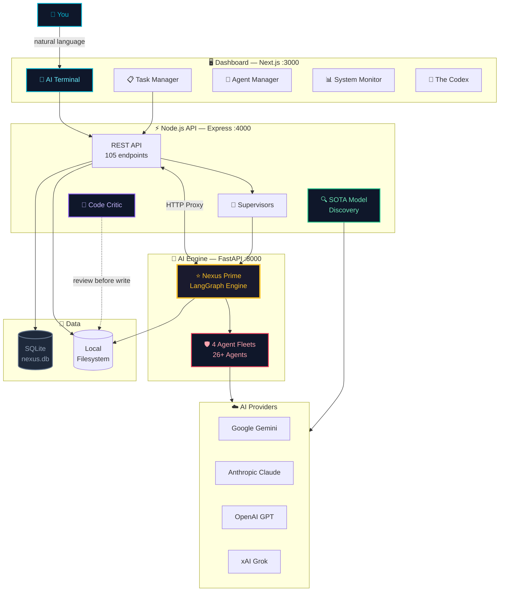
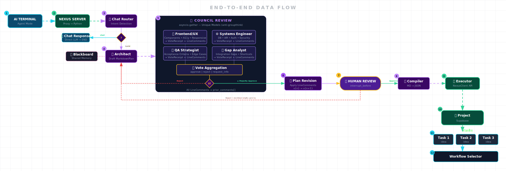
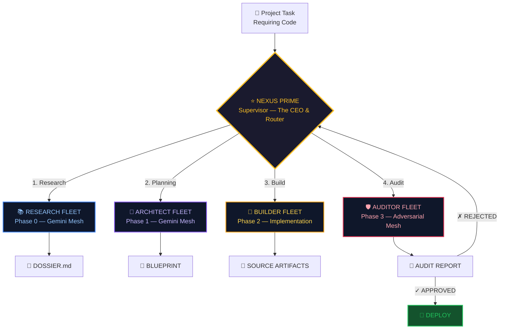
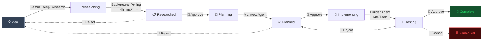
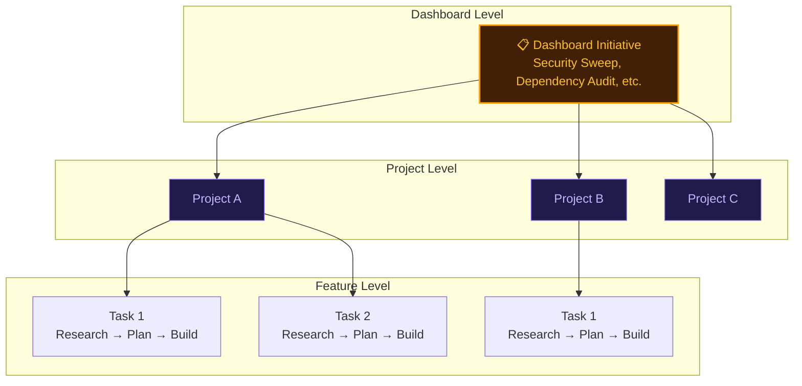

# The Nexus 🌐

**Personal Agentic Workspace** — Turns your ideas into real, manageable projects on your computer. 26+ specialized AI agents handle everything from research to code to security — you manage the vision, not the syntax.

🌐 [vibeshiftai.com/the-nexus](https://vibeshiftai.com/the-nexus)

[](https://nodejs.org)
[](https://nextjs.org)
[](https://langchain-ai.github.io/langgraph/)

---

## Overview

The Nexus bridges your local filesystem with an intelligent web dashboard, turning your laptop into a connected development fortress. Every decision passes through a human-in-the-loop review gate, so you manage the project, not the code.

- **No-Code Design** — The system writes, reviews, and audits code for you
- **26+ Specialized Agents** — Researchers, architects, builders, auditors, critics, and more
- **AI Terminal** — Multi-provider chat interface (Gemini, Claude, OpenAI, Grok)
- **The AI Mesh** — 4 specialized fleets orchestrated by Nexus Prime with adversarial review
- **The Pipeline** — 8-node orchestrator that turns ideas into organized projects with tasks
- **Task Manager** — Full lifecycle: Idea → Research → Plan → Build → Audit → Complete
- **SOTA Model Discovery** — Automatic detection of the latest AI models at startup
- **The Codex** — Interactive architecture visualizations and documentation hub
- **MCP Server** — Model Context Protocol integration for AI agent interoperability

---

## Architecture



### The Pipeline — End-to-End Data Flow

From your idea to deployed code — the **8-node Project Plan Generator** orchestrates every step. Infrastructure includes the **Blackboard** (shared memory) and **Glass Box Broadcasting** (WebSocket artifacts for real-time visibility). [See it live →](https://vibeshiftai.com/pipeline)



### Directory Structure

```
TheNexus/                           # Flat monorepo
├── server/                         # Node.js Express backend
│   ├── server.js                   # Main API server
│   ├── scanner.js                  # Project discovery engine
│   ├── mcp.js                      # MCP Server (stdio)
│   ├── agent/                      # Multi-provider AI agent
│   ├── routes/                     # Modular route handlers
│   ├── services/                   # Business logic services
│   │   ├── model-discovery.js      # SOTA model auto-detection
│   │   ├── critic.js               # Code review service
│   │   ├── langgraph-supervisor.js # LangGraph task supervisor
│   │   └── ...                     # 10+ more services
│   └── tools/                      # Agent tool definitions
├── dashboard/                      # Next.js 16 frontend
│   └── src/
│       ├── app/                    # App Router pages
│       ├── components/             # UI components
│       └── lib/nexus.ts            # Centralized API client
├── nexus-builder/                  # Python LangGraph engine (Nexus Prime)
│   ├── main.py                     # FastAPI entry point
│   ├── graph_engine.py             # LangGraph workflow engine
│   ├── architect/                  # Architect agent (planning)
│   ├── builder/                    # Builder agent (implementation)
│   ├── auditor/                    # Auditor agent (adversarial review)
│   ├── supervisor/                 # Supervisor agent (orchestration)
│   └── researcher/                 # Research agent
├── cortex/                         # Python AI Brain (Pipeline orchestrator)
├── sandbox/                        # Secure code execution sandbox
├── config/                         # Centralized configuration
│   ├── model_registry.yaml         # LLM model configs
│   └── prompts.yaml                # System prompts
├── db/                             # SQLite schema & migrations
├── .context/                       # Project context docs (for AI agents)
└── start-local.example.bat         # Startup script template (copy to start-local.bat)
```

---

## Quick Start

### Prerequisites

- **Node.js** 18+ / **Python** 3.10+ / **npm**
- API keys for AI providers (at least one)

### Installation

```bash
git clone https://github.com/VIbeShiftAI/TheNexus.git
cd TheNexus

# Backend
npm install

# Dashboard
cd dashboard && npm install && cd ..

# Python engine
cd nexus-builder
python -m venv venv
venv\Scripts\activate     # Windows
pip install -r requirements.txt
cd ..

# Configure
cp .env.example .env                    # Edit with your API keys
cp start-local.example.bat start-local.bat  # Startup script
```

### Running

```batch
start-local.bat
```

Opens 3 terminal windows:
1. **LangGraph Engine** — Python (port 8000)
2. **Node.js Backend** — Express API (port 4000)
3. **Next.js Dashboard** — Frontend (port 3000)

| Endpoint | URL |
|----------|-----|
| Dashboard | http://localhost:3000 |
| Node.js API | http://localhost:4000 |
| LangGraph API | http://localhost:8000 |

---

## Configuration

```env
# Required
PROJECT_ROOT=/path/to/your/projects

# AI Providers (at least one)
GOOGLE_API_KEY=your-key
ANTHROPIC_API_KEY=your-key
OPENAI_API_KEY=your-key
XAI_API_KEY=your-key

# Frontend
NEXT_PUBLIC_API_URL=http://localhost:4000
NEXT_PUBLIC_CORTEX_URL=http://localhost:8000
```

---

## SOTA Model Discovery

On startup, the Model Discovery Service (`server/services/model-discovery.js`) queries the model listing APIs of all 4 providers in parallel, matches models against known families (Gemini Pro, Claude Opus, GPT, Grok), and selects the **highest version** per family — zero-config model upgrades.

---

## The AI Mesh — Nexus Prime Workflow Engine

Nexus Prime — the CEO — delegates to 4 specialized fleets. Each fleet is a team of AI agents with distinct roles, quality gates, and rejection loops. [See it live →](https://vibeshiftai.com/ai-mesh)



### Fleet Details

| Phase | Fleet | Agents | Output |
|-------|-------|--------|--------|
| 0 | **Research** (Gemini Mesh) | Scoper → Professor → Executor → Synthesizer | `DOSSIER.md` |
| 1 | **Architect** (Gemini Mesh) | Cartographer → Drafter → Grounder | `BLUEPRINT` (SPEC + MANIFEST + DDB) |
| 2 | **Builder** (Implementation) | ⚙Loader → Scout → Builder → ⚙Syntax Check | Source artifacts + DIFF.patch |
| 3 | **Auditor** (Adversarial) | ⚙Blast Calc → Sentinel → Interrogator | Audit Report (Pass/Fail + Security Score) |

Each fleet has internal quality gates — the **Council Review** uses a "Society of Minds" pattern where Critic, Safety, and Efficiency voters score plans. Auditor rejections cycle back to Nexus Prime for retry with critique.

---

## Task Manager



Each stage has human-in-the-loop gates. Research runs asynchronously with automatic resume on server restart.

---

## Multi-Level Workflow System



Three workflow levels cascade: **Dashboard Initiatives** (cross-project) → **Project Workflows** (multi-stage templates) → **Feature Tasks** (individual implementation). See `.context/dashboard-workflow-map.md` and `.context/project-workflow-map.md` for detailed sequence diagrams.

---

## Agent Tools

| Tool | Description |
|------|-------------|
| `read_file` | Read file contents with offset/range support |
| `write_file` | Create or overwrite file (with Critic review) |
| `patch_file` | Replace specific text in file |
| `append_file` | Append content to end of file |
| `apply_diff` | Apply unified diff for targeted edits |
| `edit_lines` | Edit specific lines by line number |
| `list_directory` | List directory contents |
| `run_command` | Execute shell command in project directory |
| `check_ports` | List active listening ports |
| `kill_process` | Terminate a process by PID or port |
| `checkpoint_memory` | Save checkpoint context for long-running tasks |

---

## The Codex

The Codex (`/codex`) is the documentation hub with interactive visualizations:

| Section | Description |
|---------|-------------|
| **End-to-End Data Flow** | SVG diagram of the full 8-node pipeline |
| **Vibecoding Workflow** | Interactive diagram of all 4 fleets with sub-agents |
| **Initiative Hierarchy** | Dashboard → Projects → Tasks cascade |
| **Interface Overview** | Annotated screenshots of Dashboard and Project views |
| **Agent Registry** | Live browsable registry of all agents and fleets |

---

## Dashboard Components

| Component | Description |
|-----------|-------------|
| `ai-terminal.tsx` | Multi-provider AI chat interface |
| `task-manager.tsx` | Task management with status pipeline |
| `task-detail-modal.tsx` | Full task workflow UI |
| `agent-manager.tsx` | Configure AI agents |
| `resource-monitor.tsx` | System monitor (CPU/memory/ports) |
| `activity-feed.tsx` | Recent commits across projects |
| `dashboard-initiatives.tsx` | Cross-project initiative management |
| `project-card.tsx` | Project tile with git status |
| `project-context-manager.tsx` | Project context document editor |
| `project-workflows.tsx` | Project-level workflow management |

---

## Development

### Adding Agent Tools

1. Create tool definition in `server/tools/` with Zod schema
2. Export from `server/tools/index.js`
3. Tools are automatically available to agents and MCP server

### Adding AI Model Families

Add a pattern to `MODEL_FAMILIES` in `server/services/model-discovery.js` — the service auto-detects the latest version at next startup.

### Further Documentation

Detailed architectural docs live in:
- **`.context/`** — API reference, workflow maps, pipeline architecture, node reference, tech stack
- **`docs/`** — System architecture, data flow diagrams
- **The Codex** — Interactive visualizations at `/codex` in the dashboard

---

## Built With

The Nexus stands on the shoulders of outstanding open-source projects:

### AI Engine (Python)

- **[LangGraph](https://langchain-ai.github.io/langgraph/)** — Multi-agent workflow orchestration powering Nexus Prime and the 4 fleet system
- **[LangChain](https://www.langchain.com/)** — Foundation for AI provider integrations and tool-calling agents
- **[FastAPI](https://fastapi.tiangolo.com/)** — High-performance async Python API serving the LangGraph engine

### Backend (Node.js)

- **[Express](https://expressjs.com/)** — REST API backbone (105+ endpoints)
- **[Better-SQLite3](https://github.com/WiseLibs/better-sqlite3)** — Synchronous SQLite driver for persistence
- **[Socket.IO](https://socket.io/)** — Real-time WebSocket streaming for Glass Box Broadcasting
- **[Zod](https://zod.dev/)** — Schema validation for agent tool definitions
- **[simple-git](https://github.com/steveukx/git-js)** — Git integration for project discovery and commit tracking
- **[Helmet](https://helmetjs.github.io/)** — HTTP security headers
- **[@modelcontextprotocol/sdk](https://github.com/modelcontextprotocol/typescript-sdk)** — MCP server integration

### Frontend (Next.js)

- **[Next.js](https://nextjs.org/)** — React framework powering the dashboard (App Router)
- **[React](https://react.dev/)** — UI component library
- **[Tailwind CSS](https://tailwindcss.com/)** — Utility-first styling
- **[Framer Motion](https://motion.dev/)** — Animations and transitions
- **[Lucide React](https://lucide.dev/)** — Icon system
- **[React Flow](https://reactflow.dev/)** (`@xyflow/react`) — Interactive node-based visualizations in The Codex
- **[Monaco Editor](https://microsoft.github.io/monaco-editor/)** — Code editing component
- **[Recharts](https://recharts.org/)** — Dashboard charts and system monitoring graphs
- **[react-markdown](https://github.com/remarkjs/react-markdown)** — Markdown rendering with GFM support

### AI Providers

- **[Google Gemini](https://ai.google.dev/)** · **[Anthropic Claude](https://www.anthropic.com/)** · **[OpenAI](https://openai.com/)** · **[xAI Grok](https://x.ai/)**

---

## License

This project is proprietary. See the repo owner for licensing information.

---

**GitHub:** https://github.com/VIbeShiftAI/TheNexus
