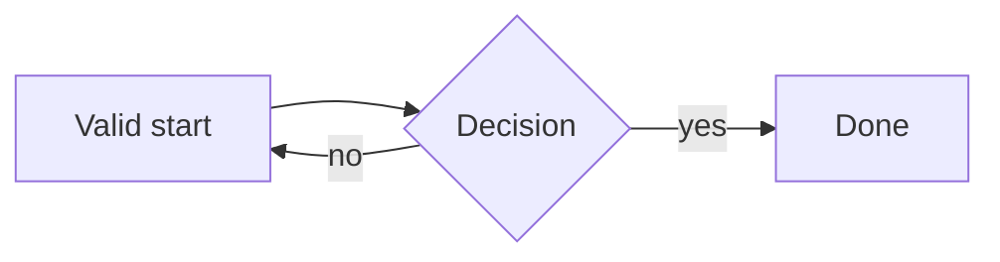
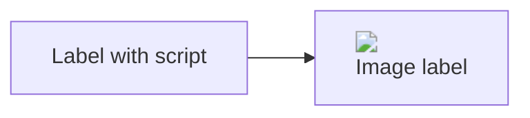

# Mermaid verification cases

Prose before the first diagram.



*Figure 1. A valid diagram with a caption.*

```mermaid
flowchart LR
  A[Broken --> 
  this is not valid mermaid ((
```

*Figure 2. This caption follows a broken diagram.*



*Figure 3. Hostile labels and click directives.*

```js
const ordinary = "fence stays a code block";
```

<script>window.__rawHtmlPwned = true</script>

Prose after the last diagram.
