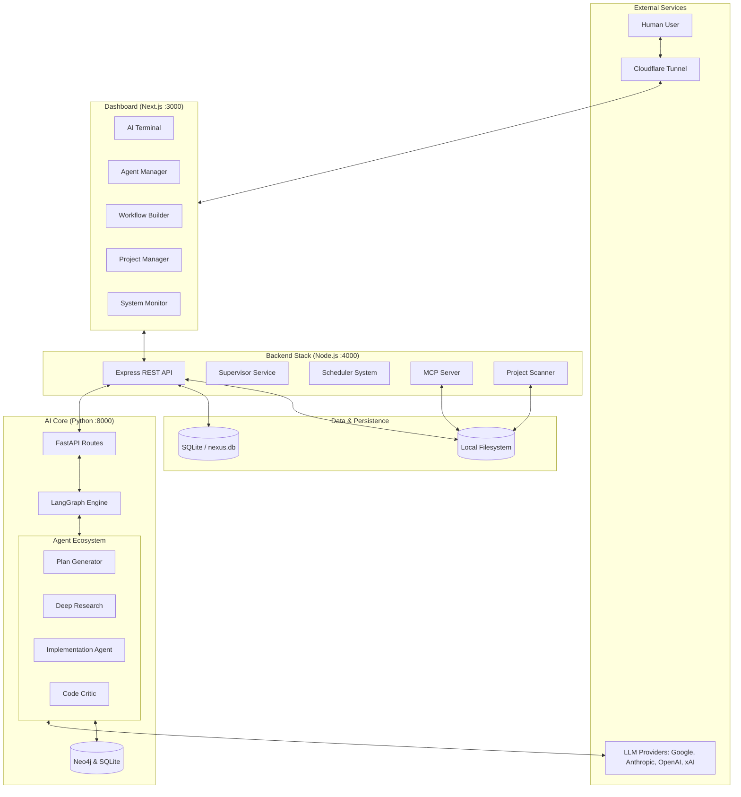

# The Nexus: System Architecture

**Version:** 4.0
**Status:** Operational / Integrated
**System Type:** Personal Agentic Workspace & AI Orchestration Engine
**Primary Interface:** The Nexus AI Terminal & Dashboard

---

## 1. High-Level Architecture

The Nexus operates as a **hybrid local-cloud platform** consisting of interconnected subsystems:

- **AI Core (Cortex & Nexus-Builder)**: Python-based reasoning engines, workflow builders, and LangGraph orchestration.
- **Backend Services (Node.js)**: REST API, Task Manager, Scheduler System, Supervisor, and MCP Server.
- **Frontend Dashboard (Next.js)**: The visual orchestration canvas, AI Terminal, and Agent Manager.



---

## 2. Repository Structure

```text
TheNexus/                       # Flat monorepo
├── server/                     # Node.js Express backend
│   ├── server.js               # Main API server
│   ├── scanner.js              # Project discovery engine
│   ├── mcp.js                  # MCP Server (stdio)
│   ├── agent/                  # Multi-provider AI agent
│   ├── services/               # Supervisor, critic, system monitor
│   ├── scheduler/              # Cron-based automation
│   ├── tools/                  # Filesystem & command tools
│   └── utils/                  # Retry utilities
├── dashboard/                  # Next.js 16 frontend
│   └── src/
│       ├── app/                # App Router pages
│       ├── components/         # AI Terminal, Agent Manager, etc.
│       └── lib/nexus.ts        # API client
├── cortex/                     # Python AI Brain (LangGraph)
│   ├── agents/                 # Planner, Council, Browser, Compiler
│   ├── api/                    # Terminal bridge, routes
│   ├── core/                   # Orchestrator graph
│   ├── schemas/                # Pydantic state models
│   ├── blackboard/             # Research blackboard
│   └── llm_factory.py          # Multi-provider LLM routing
├── nexus-builder/              # Python graph engine & workflow
│   ├── main.py                 # FastAPI entry point
│   ├── graph_engine.py         # Workflow graph engine
│   └── researcher/             # Research agent
├── sandbox/                    # Secure code execution sandbox
├── config/                     # Merged configuration
│   ├── model_registry.yaml     # LLM model configs
│   ├── prompts.yaml            # System prompts
│   └── nexus/                  # Nexus-specific config
├── db/                         # SQLite schema & database
└── docker/                     # Dockerfiles & compose files
```

---

## 3. Workflow & Orchestration System

The Nexus uses a multi-level workflow system orchestrated by the **Supervisor Agent**.

### Task Development Workflow

```mermaid
graph LR
    Idea[Idea] -->|Gemini Deep Research| Researching[Researching]
    Researching -->|Approve| Researched[Researched]
    Researched -->|Claude Opus Plan| Planning[Planning]
    Planning -->|Approve| Planned[Planned]
    Planned -->|Implementation Agent| Implementing[Implementing]
    Implementing -->|Walkthrough| Testing[Testing]
    Testing -->|User Review| Complete[Complete]
```



### Key State Components

- **Task Ledger**: Tracks completed tasks and prevents re-execution. Maintains a ledger of completed phases and phase outputs.
- **Agent Memory System**: Episodic memory providing continuity. Stores decisions, observations, feedback, errors, and insights.
- **Blackboard**: Used during research phases for evidence gathering and fact-checking.

### Initiative Workflows

Dashboard-level initiatives iterate over target projects, triggering project-level LangGraph workflows for each. Project-level templates are auto-discovered from `config/templates/workflows/*.json` by the Python backend.

| Template | Level | Pipeline | Output |
|----------|-------|----------|--------|
| `documentation.json` | project | `codebase_explorer` → `general_agent` → `doc_task_creator` | Documentation update tasks |
| `security-sweep-project.json` | project | `codebase_explorer` → `general_agent` → `security_task_creator` | Security remediation tasks (nexus-prime) |
| `security-sweep.json` | dashboard | `audit-deps` → `check-secrets` → `review-perms` → `generate-report` | Aggregate security report |

---

## 4. Component Reference

### AI Core (Python / LangGraph)

| Module | Purpose |
|--------|---------|
| **Cortex Core** | System orchestration, persistence (AsyncSqliteSaver), and prompting via `prompts.yaml`. |
| **Nexus-Builder** | FastAPI backend serving the workflow graph engine and LangGraph node registry. |
| **LLM Factory** | Multi-provider router managing Anthropic, Google, and OpenAI models. |
| **Deep Research** | Gemini-powered recursive web research agent with background polling. |
| **Code Critic** | Reviews code before writes for logical, security, and style issues. |
| **Memory Systems** | GraphRAG with Neo4j for semantic retrieval; SQLite for LangGraph checkpoints. |

### Backend Stack (Node.js)

| Component | Purpose |
|-----------|---------|
| **server.js** | Main Express API server. |
| **scanner.js** | Priority-based filesystem scanner to detect and index projects in `PROJECT_ROOT`. |
| **supervisor.js** | Orchestrates the Task Manager, routing intents to specific workers. |
| **scheduler.js** | Cron-based automation engine for recurring tasks (e.g., dependency audits). |
| **mcp.js** | Model Context Protocol server exposing Nexus capabilities to external AI clients. |

### Frontend (Dashboard)

| Component | Purpose |
|-----------|---------|
| **AI Terminal** | Primary multi-provider chat interface with state inspector. |
| **Workflow Builder** | Visual React Flow canvas for designing agent workflows. |
| **Agent Manager** | Dashboard UI for configuring agent behaviors, system prompts, and models. |
| **System Monitor** | Real-time tracking of CPU, memory, tokens, and active ports. |

---

## 5. Configuration & Environments

### Environment Variables (`.env`)

```properties
# System Configuration
PROJECT_ROOT=P:/Projects

# AI Providers
GOOGLE_API_KEY=...
ANTHROPIC_API_KEY=...
OPENAI_API_KEY=...

# Backend Integration
PYTHON_BACKEND_URL=http://localhost:8000
NEXUS_SERVICE_KEY=...
```

### Model Configuration (`config/model_registry.yaml` & `agent-config.json`)

The system uses role-based model assignments, configurable via the Agent Manager UI. 

---

## 6. Security & Infrastructure

- **Cloudflare Tunnel:** Exposes the dashboard (port 3000) securely via Zero Trust.
- **Sandbox Execution:** Code implementation and scheduled tasks run in isolated, timeout-restricted environments.
- **Command Blocking:** Destructive commands (`rm -rf`, `format`) are automatically blocked.
- **Project Scoping:** Context and tool execution can be restricted to a specific `projectId`.

---

## 7. Operational Commands

### Start the Full Stack (Windows)
```batch
start-nexus.bat
```
Starts Cloudflare Tunnel, Node.js API (:4000), and Next.js Dashboard (:3000).

### Start Locally (No Tunnel)
```batch
start-local.bat
```

### MCP Server (Standalone)
```bash
node server/mcp.js
```