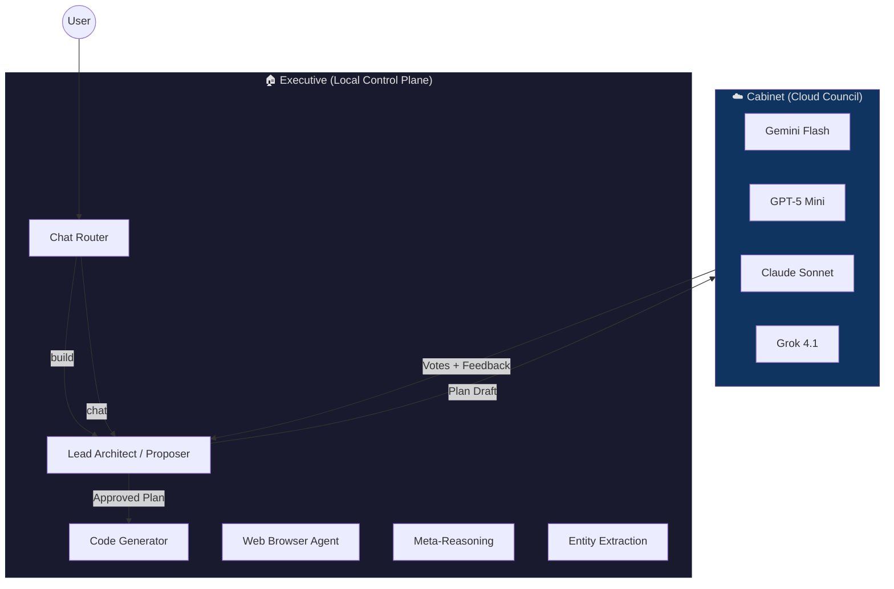
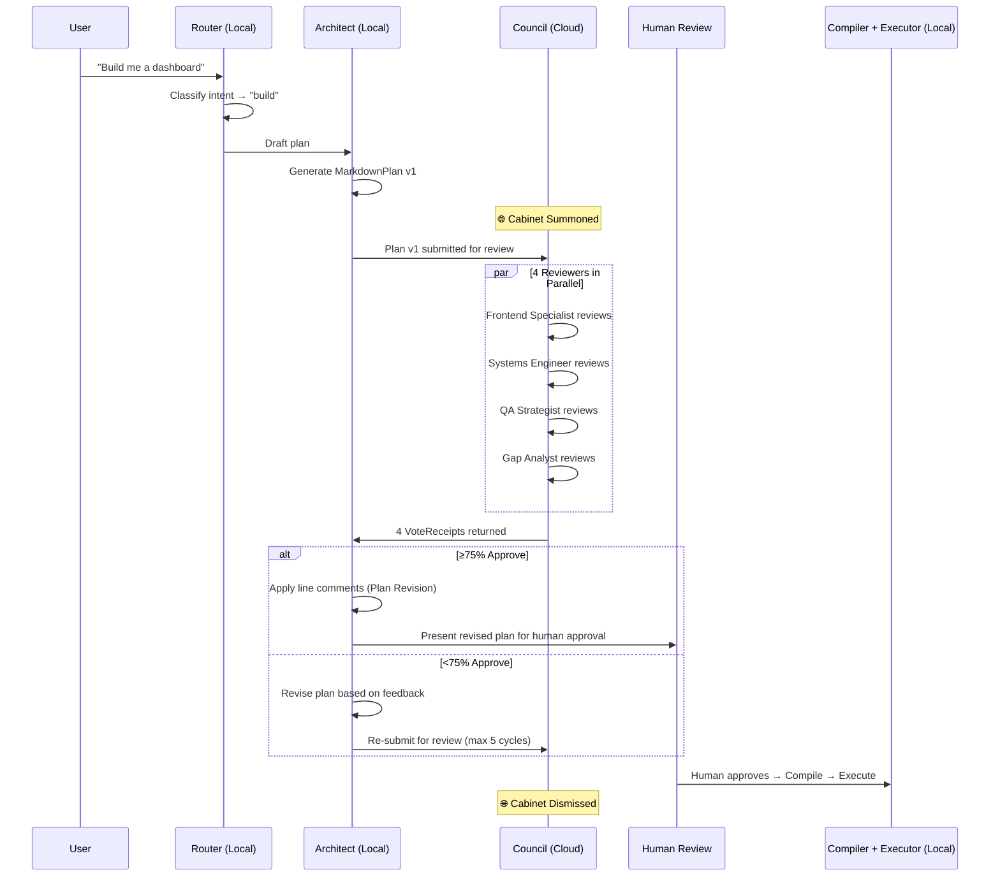

# Executive & Cabinet: The Nexus Control Plane Architecture

**Version:** 1.0  
**Status:** Active  
**Last Updated:** 2026-05-01  

---

## 1. Overview

The Nexus operates on an **Executive & Cabinet** governance model — a two-tier architecture where a **local, privacy-first AI** acts as the autonomous control plane (the **Executive**), and a diverse panel of **cloud LLMs** serves as an advisory council (the **Cabinet**) summoned only for high-stakes decisions.

This design optimizes for three competing goals:

| Goal | Mechanism |
|---|---|
| **Cost** | Local model handles 90%+ of operations at zero API cost |
| **Privacy** | Sensitive data never leaves the local machine by default |
| **Quality** | Cloud multi-provider diversity prevents groupthink on strategic decisions |



---

## 2. The Executive (Local Model)

### Identity

The Executive is the **primary driver** for all standard pipeline operations. It runs on the operator's hardware via an OpenAI-compatible local inference server (Ollama, LM Studio, or vLLM).

| Property | Value |
|---|---|
| **Default Model** | `qwen3:32b` (configurable via `LOCAL_AI_MODEL`) |
| **Endpoint** | `http://localhost:11434/v1` (configurable via `LOCAL_AI_URL`) |
| **Provider Type** | `local` — OpenAI-compatible `/chat/completions` API |
| **API Key** | Optional (`LOCAL_AI_API_KEY`) — most local servers don't require one |
| **Cost** | $0.00 per token |

### Roles Handled

The Executive handles **all** roles in the standard pipeline:

| Role | Function | Temperature |
|---|---|---|
| `proposer` | Lead Architect — drafts and revises project plans | 0.9 |
| `router` | Chat/Build intent classification | 0.0 |
| `architect` | System design and deep planning | 0.3 |
| `builder` | Code generation and execution | 0.2 |
| `browser` | Recursive web browsing and content evaluation | 0.1 |
| `visual_interpreter` | Multi-modal image analysis | 0.1 |
| `entity_extractor` | Keyword and entity extraction | 0.1 |
| `orchestrator` | Meta-reasoning and task decomposition | 0.2 |

### Configuration

All Executive roles use a `fixed` strategy in `model_registry.yaml`:

```yaml
proposer:
  strategy: fixed
  model: local-default
  temperature: 0.9
  description: "Lead Architect — local model as primary orchestrator"
```

The `local-default` model definition:

```yaml
local-default:
  provider: local
  family: Local
  model_name: qwen3:32b
  context_window: 131072
  capabilities: ["reasoning", "code", "tool_use"]
  cost_per_1k_input: 0.0
  cost_per_1k_output: 0.0
```

---

## 3. The Cabinet (Cloud Council)

### Identity

The Cabinet is the **Cortex Council** — a panel of 4 domain-expert reviewers that critique the Executive's plans. Each reviewer is backed by a different cloud LLM, selected via shuffle from a multi-provider pool.

The Council exists because **a single model reviewing its own work produces confirmation bias**. By requiring diverse providers, the Cabinet ensures genuine independent critique.

### Council Members

| Reviewer | Expertise | LLM Source |
|---|---|---|
| **Frontend/UX Specialist** | React, accessibility, responsive design | Shuffled from pool |
| **Systems Engineer** | Database, API, security, deployment | Shuffled from pool |
| **QA Strategist** | Acceptance criteria, edge cases, validation | Shuffled from pool |
| **Gap Analyst** | Integration gaps, missing features, shortcuts | Shuffled from pool |

### Cloud Model Pool

```yaml
reviewer:
  strategy: shuffle
  pool: [gemini-flash, gpt-5-mini, claude-sonnet, grok-4.1]
  temperature: 0.3
  description: "Council reviewers — shuffled diverse CLOUD models for anti-groupthink"
```

| Model ID | Provider | Model Name | Purpose |
|---|---|---|---|
| `gemini-flash` | Google | `gemini-3-flash-preview` | Fast, cost-effective reviews |
| `gpt-5-mini` | OpenAI | `gpt-5-mini-2025-08-07` | Strong reasoning at low cost |
| `claude-sonnet` | Anthropic | `claude-sonnet-4-6` | Precise, safety-aware critique |
| `grok-4.1` | xAI | `grok-4-1-fast-reasoning` | Real-time data, contrarian perspective |

### Provider Diversity Enforcement

The Council enforces a **minimum of 2 distinct API providers** via the `min_providers` parameter in `get_unique_models()`. This is a hard requirement — if fewer than 2 providers have valid API keys, the Council refuses to assemble.

```python
# cortex/agents/council.py — Line 254
unique_models = factory.get_unique_models(
    ModelRole.REVIEWER, len(member_ids),
    labels=member_ids,
    min_providers=2  # ← Enforced ONLY for Council
)
```

> **Key design decision:** The `min_providers` constraint is **not enforced** for standard pipeline roles. Only the Council requires multi-provider diversity. This means the Executive can operate entirely offline with zero cloud dependencies.

---

## 4. Communication Protocol

### When Is the Cabinet Summoned?

The Cabinet is summoned **exclusively** during the `council_review` node of the LangGraph orchestration pipeline. This happens when:

1. The user's intent is classified as `build` (not `chat`)
2. The Executive's Architect has drafted a project plan
3. The plan is not an error/fallback plan



### Trigger Conditions (Summary)

| Condition | Cabinet Summoned? | Rationale |
|---|---|---|
| Chat/greeting/question | ❌ No | Handled entirely by Executive |
| Build request — plan drafting | ❌ No | Executive drafts autonomously |
| Build request — plan review | ✅ **Yes** | Diverse critique prevents groupthink |
| Plan revision after rejection | ❌ No | Executive revises locally |
| Plan re-review after revision | ✅ **Yes** | Fresh council vote needed |
| Human-approved plan compilation | ❌ No | Mechanical JSON conversion |
| Task execution in Nexus | ❌ No | API calls to Nexus backend |

### Data Flow Boundaries

```
┌─────────────────────────────────────────────────────────┐
│                    LOCAL MACHINE                         │
│                                                         │
│  User Input ──→ Router ──→ Architect ──→ Plan v1       │
│                                              │          │
│                                    ┌─────────┴────────┐ │
│                                    │ OUTBOUND TO CLOUD │ │
│                                    │                   │ │
│                                    │  • Plan content   │ │
│                                    │  • System prompts │ │
│                                    │  • Prior comments │ │
│                                    │                   │ │
│                                    │  NOT sent:        │ │
│                                    │  • User identity  │ │
│                                    │  • API keys       │ │
│                                    │  • Local file     │ │
│                                    │    contents       │ │
│                                    │  • DB records     │ │
│                                    └─────────┬────────┘ │
│                                              │          │
│  Compiler ←── Human Review ←── Revised Plan ←┘         │
│     │                                                   │
│  Executor ──→ Nexus API ──→ Tasks Created              │
│                                                         │
└─────────────────────────────────────────────────────────┘
```

---

## 5. Implementation Details

### LLMFactory Provider Routing

The `LLMFactory` singleton (`cortex/llm_factory.py`) routes model requests based on the `provider` field in `model_registry.yaml`:

```python
# Provider routing in _create_driver()
match provider:
    case "local":
        # → ChatOpenAI(base_url=settings.local_ai_url)
        # No API key required (Ollama default)
    case "openai":
        # → ChatOpenAI(api_key=settings.openai_api_key)
    case "anthropic":
        # → ChatAnthropic(api_key=settings.anthropic_api_key)
    case "google":
        # → ChatGoogleGenerativeAI(google_api_key=settings.google_api_key)
    case "xai":
        # → ChatOpenAI(base_url="https://api.x.ai/v1")
```

### Local Model Availability

The `local` provider is **always considered available** — it bypasses the API key validation check that cloud providers must pass:

```python
def _is_model_available(self, model_id: str) -> bool:
    provider = model_def.get("provider", "")
    if provider == "local":
        return True  # Always available — no cloud key needed
    # ... cloud key validation ...
```

### Node.js Alignment

The Node.js backend (`server/services/ai-service.js`) independently supports the `local` provider via `callLocal()`, using the same OpenAI-compatible endpoint pattern:

```javascript
// Resolve endpoint: explicit config > env var > Ollama default
const baseUrl = params.base_url
    || process.env.LOCAL_AI_URL
    || 'http://localhost:11434/v1';
```

Both Python and Node.js stacks share the same `LOCAL_AI_URL` environment variable, ensuring consistency.

---

## 6. Configuration Reference

### Environment Variables

| Variable | Default | Purpose |
|---|---|---|
| `LOCAL_AI_URL` | `http://localhost:11434/v1` | OpenAI-compatible endpoint for local inference |
| `LOCAL_AI_API_KEY` | *(none)* | Optional bearer token for servers that require auth (vLLM) |
| `LOCAL_AI_MODEL` | `qwen3:32b` | Default model name passed to the local server |

### Switching the Local Model

To use a different local model (e.g., Llama, Mistral, DeepSeek):

1. Pull the model in Ollama: `ollama pull llama3.3:70b`
2. Update `.env`: `LOCAL_AI_MODEL=llama3.3:70b`
3. Update `config/model_registry.yaml`:
   ```yaml
   local-default:
     model_name: llama3.3:70b
   ```
4. Restart the LangGraph server

### Falling Back to Cloud

To temporarily route all traffic through cloud models (e.g., local GPU unavailable), revert the role assignments in `model_registry.yaml`:

```yaml
proposer:
  strategy: shuffle
  pool: [claude-opus, gemini-pro]  # ← Original cloud pool
```

No code changes required — the factory reads the registry at startup.

---

## 7. Cost Model

### Before: All-Cloud Pipeline

| Operation | Models Used | Est. Cost / Plan |
|---|---|---|
| Routing | Gemini Flash | ~$0.001 |
| Plan Drafting (2 revisions) | Claude Opus / Gemini Pro | ~$0.15 |
| Council Review (4 reviewers × 2 rounds) | Mixed cloud pool | ~$0.08 |
| Compilation | Claude Opus | ~$0.05 |
| **Total** | | **~$0.28 / plan** |

### After: Executive & Cabinet

| Operation | Models Used | Est. Cost / Plan |
|---|---|---|
| Routing | Local (qwen3:32b) | **$0.00** |
| Plan Drafting (2 revisions) | Local (qwen3:32b) | **$0.00** |
| Council Review (4 reviewers × 2 rounds) | Mixed cloud pool | ~$0.08 |
| Compilation | Local (qwen3:32b) | **$0.00** |
| **Total** | | **~$0.08 / plan** |

> **~71% cost reduction** with quality preserved where it matters most (the Council).

---

## 8. Future Considerations

- **Adaptive Summoning**: Use a confidence score from the Executive to decide whether the Cabinet is needed at all. Simple, well-scoped plans could skip Council review entirely.
- **Local Council Members**: As local model quality improves, consider adding a local model to the reviewer pool alongside cloud models (hybrid Cabinet).
- **Tiered Cabinet**: Introduce a "lightweight cabinet" (2 fast cloud reviewers) for simple plans and a "full cabinet" (4 diverse reviewers) for complex architectural decisions.
- **Offline Mode**: Implement a complete offline pipeline where the Executive self-reviews using temperature-varied local model instances as pseudo-diverse reviewers.
