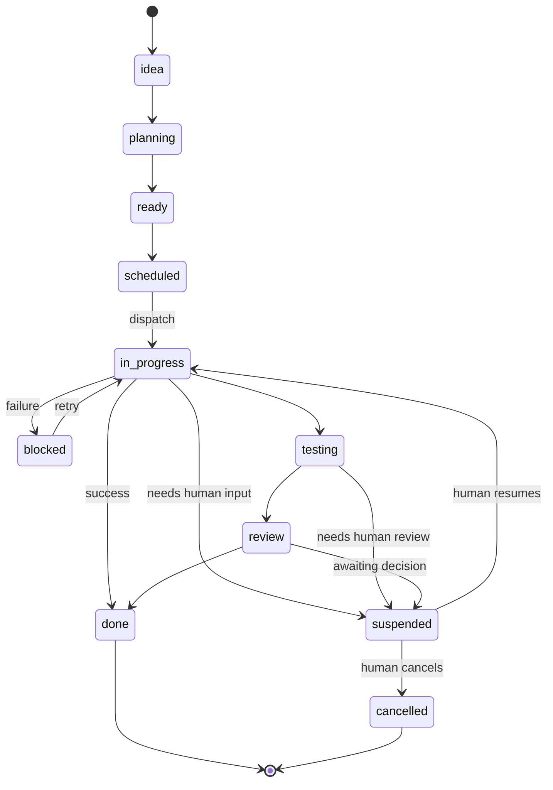

# Design: Task Suspension for Human Input

> Schema and state machine logic for the `suspended` task status,
> enabling Praxis to pause autonomous execution and await human input.

---

## 1. Problem

Praxis currently has only two pathways for handling tasks that need human
input: **blocking** (setting status to `blocked`, which signals a failure)
or **completing** (returning a result with a question embedded in text).
Neither is correct:

- `blocked` implies the task **failed** and triggers the failure/retry
  pipeline (Telegram notifications, QA rejection logic, etc.)
- Completing with a question means the human must remember to manually
  re-dispatch — there's no state machine to track "I asked a question
  and I'm waiting for the answer"

A **`suspended`** status explicitly represents: "I stopped on purpose.
I need human input. When I get it, resume from where I left off."

---

## 2. State Machine

### 2.1 Current Task States

From the codebase, the existing task statuses are:

```
idea → planning → ready → scheduled → in-progress → testing → review → done/complete
                    ↘ blocked (failure path)
                    ↘ cancelled / archived (terminal)
```

### 2.2 Proposed State Machine with `suspended`



### 2.3 Transition Rules

| From | To | Trigger | Who |
|------|-----|---------|-----|
| `in-progress` | `suspended` | Agent hits uncertainty, SELFDOUBT circuit breaker trips, budget gate, or task explicitly requests guidance | Praxis (automatic) |
| `testing` | `suspended` | QA review requires human judgment (ambiguous acceptance criteria) | Praxis (automatic) |
| `review` | `suspended` | Plan/research needs human approval (existing `awaiting_approval` concept) | Praxis/LangGraph |
| `suspended` | `in-progress` | Human provides input via dashboard or chat, Praxis re-dispatches | Human → Praxis |
| `suspended` | `cancelled` | Human decides the task is no longer needed | Human |

> **Important:** `suspended` is **not a failure state**. It should not trigger error
> notifications, retry logic, or QA rejection flows. It is a deliberate pause.

---

## 3. Database Schema

### 3.1 Migration: `026_task_suspension.sql`

```sql
ALTER TABLE tasks ADD COLUMN suspended_at TEXT;
ALTER TABLE tasks ADD COLUMN suspended_reason TEXT;
ALTER TABLE tasks ADD COLUMN suspended_context TEXT;  -- JSON
ALTER TABLE tasks ADD COLUMN resume_action TEXT;       -- JSON

CREATE INDEX IF NOT EXISTS idx_tasks_suspended
ON tasks(status) WHERE status = 'suspended';
```

### 3.2 Column Definitions

| Column | Type | Description |
|--------|------|-------------|
| `suspended_at` | `TEXT` (ISO 8601) | When the task was suspended |
| `suspended_reason` | `TEXT` | Human-readable explanation |
| `suspended_context` | `TEXT` (JSON) | Serialized context needed to resume |
| `resume_action` | `TEXT` (JSON) | Instructions for what happens on resume |

### 3.3 Suspension Context Schema

```json
{
  "conversationId": "string (optional) — Antigravity convo ID",
  "workspace": "string — workspace path",
  "partialResult": "string (optional) — what was accomplished",
  "question": "string — the specific question for the human",
  "options": ["string (optional) — suggested options"],
  "workingBranch": "string (optional) — git branch",
  "confidenceScore": "number (optional) — SELFDOUBT score",
  "originalPayload": {
    "prompt": "string",
    "workspace": "string",
    "modelOverride": "string (optional)"
  }
}
```

### 3.4 Resume Action Schema

```json
{
  "type": "redispatch | status_only | custom",
  "workspace": "string (optional)",
  "instructions": "string (optional) — includes human's answer",
  "nexusTaskId": "string (optional)",
  "modelOverride": "string (optional)"
}
```

---

## 4. Suspension Triggers

### 4.1 Agent-Initiated (Praxis → Nexus)

When Praxis's SELFDOUBT circuit breaker trips or the agent determines it
needs human guidance, the callback includes `suspended: true`.

### 4.2 Callback-Initiated (Antigravity → Praxis)

When the Antigravity agent encounters a point where it cannot proceed,
it sends `suspended: true` with context in its callback payload.

### 4.3 System-Initiated (Budget Gate)

When the budget gate fires (>80% consumed), the task is suspended
rather than silently skipping the agent loop.

---

## 5. Resume Flow

1. Human sees suspended task in Nexus dashboard (amber badge)
2. Human provides input via `POST /:id/tasks/:taskId/resume`
3. Nexus clears suspension metadata, sets status to `in-progress`
4. Nexus POSTs to Praxis `POST /resume-task` with the human's input
5. Praxis re-dispatches to Antigravity with the answer baked into the prompt

---

## 6. Files Modified

| File | Change |
|------|--------|
| `TheNexus/db/migrations/026_task_suspension.sql` | **[NEW]** Schema migration |
| `TheNexus/db/index.js` | Register JSON columns; update `getBoardState` |
| `TheNexus/server/routes/tasks.js` | Add resume endpoint; add `suspended` to notify list |
| `Praxis/src/webhook.ts` | Handle `suspended` callbacks; add `/resume-task` |
| `Praxis/src/antigravity/antigravity-tools.ts` | Add `suspended` to valid statuses |
| `Praxis/src/day-scheduler.ts` | Add `suspended` slot status |
